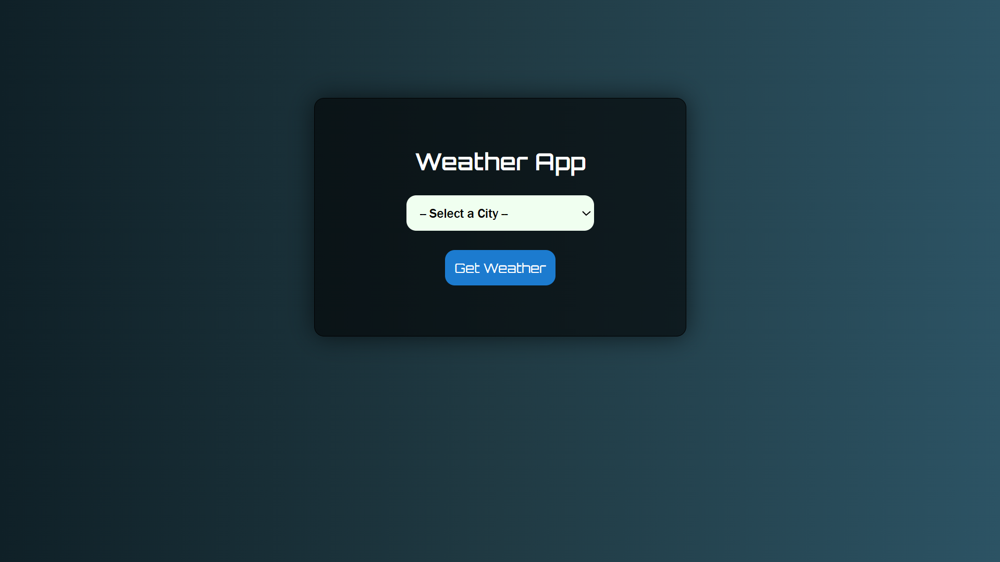
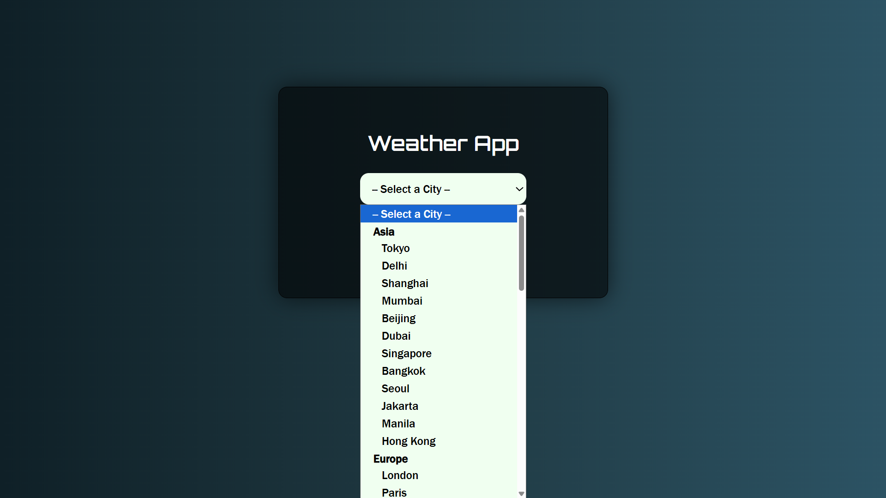
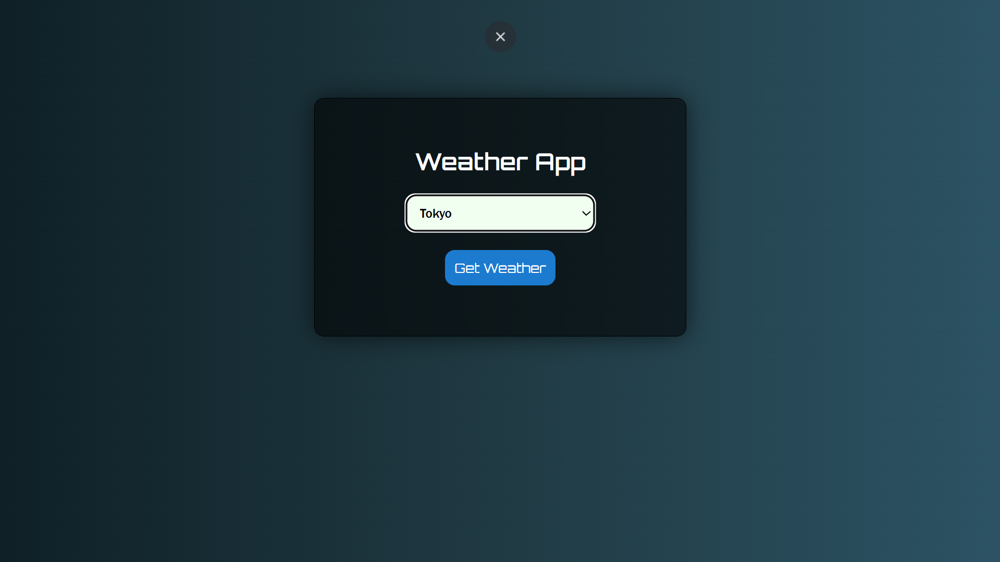
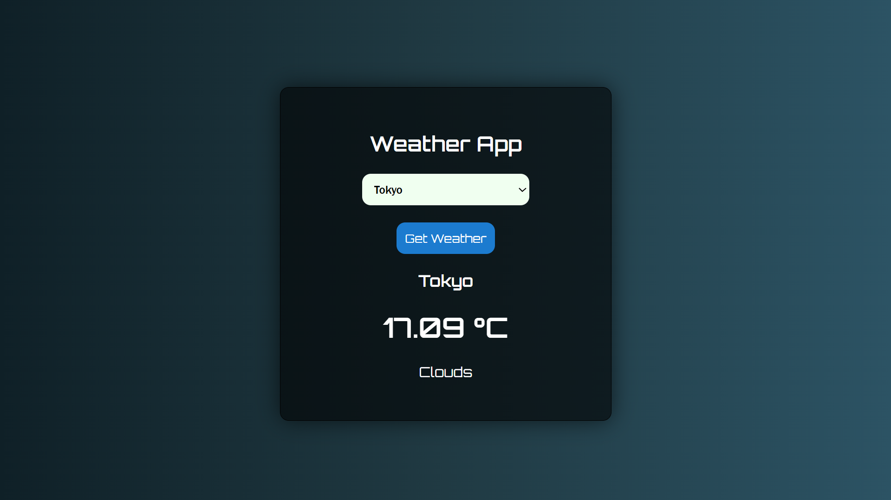

### 🌦️ Weather App

---

### 📌 Overview

A simple weather application that allows users to select a city and view real-time weather data including temperature and weather condition. The project demonstrates basic API integration and DOM manipulation using JavaScript.

---

### 🚀 Features

* Select city from dropdown
* Fetch real-time weather data
* Display:

  * City name
  * Temperature (°C)
  * Weather condition
* Clean and minimal UI
* Responsive layout

---

### 🛠️ Technologies Used


### 🟠OpenWeather API

---

### 📂 Project Structure

```
📁 main<br>
│── index.html
└── 📁 snapshot           #Demo Images & Videos
‎ ‎ ‎ ‎ ‎ ‎ ‎ ‎ ‎ ‎ ├── 1.png
‎ ‎ ‎ ‎ ‎ ‎ ‎ ‎ ‎ ‎ ├── 2.png
‎ ‎ ‎ ‎ ‎ ‎ ‎ ‎ ‎ ‎ ├── 3.png
‎ ‎ ‎ ‎ ‎ ‎ ‎ ‎ ‎ ‎ ├── 4.png
‎ ‎ ‎ ‎ ‎ ‎ ‎ ‎ ‎ ‎ ├── demo.gif     #Demo Video
```


### ⚙️ How It Works

1. User selects a city from the dropdown menu
2. On clicking **Get Weather**, a request is sent to the OpenWeather API
3. The API returns weather data in JSON format
4. JavaScript extracts:

   * Temperature
   * Weather condition
5. Data is displayed on the webpage

---

### 🔑 Setup Instructions

1. Clone the repository

```
git clone https://github.com/mdudhe2007/weather-app.git
```

2. Open `index.html`

3. Add your API key

```javascript
const apiKey = "YOUR_API_KEY";
```

4. Run the project in browser

---

### 📸 Preview

### Main Interface

 <p align="center">  </p>

### Weather Result

 <p align="center">  <br>
    <p align="center">  <br>
       <p align="center">  <br>
          <p align="center">  <br>

---

## ⚠️ Notes

* API key is required for the app to work
* Ensure internet connection is active
* If city is not selected, alert will be shown

---

## 📈 Future Improvements

* Dynamic background based on weather
* Auto-detect user location
* Add weather icons
* Improve UI/UX

---

## 👨‍💻 Author
<P ALIGN="CENTER"></P>
<p align="center"><B>DuduBoiii</B></p>
<hr>
Developed as a beginner-level project to understand API handling and JavaScript basics.

